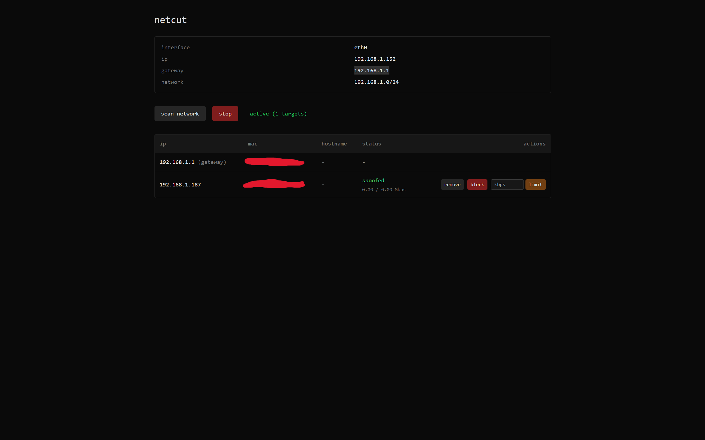

# netcut

Network control tool for your local network. Scan devices, monitor bandwidth, block or throttle connections.

Built with Python (FastAPI, Scapy) and Next.js.
# Spoofer

Lightweight network testing tool (proof-of-concept). Scan devices on a LAN, monitor per-device bandwidth, and optionally block or throttle traffic using iptables/tc.

Built with Python (FastAPI, Scapy) for the backend and Next.js for the dashboard.

## Screenshot



## Quickstart

Backend (recommended: use the included virtualenv):

```bash
cd backend
python3 -m venv venv        # if you don't have the venv
./venv/bin/pip install -r requirements.txt
# Run (use sudo for features that require root: raw sockets, iptables, tc)
sudo ./venv/bin/python3 api.py
```

Or use the helper script:

```bash
cd backend
sudo ./run_backend.sh
```

Frontend:

```bash
cd frontend
npm install
npm run dev
# Open http://localhost:3000
```

## Notes & safety

- Only run ARP spoofing and traffic-control features on networks you own or are explicitly permitted to test.
- Full functionality requires Linux and root privileges for packet/iptables operations.

## API

API docs are available when the backend is running at `http://localhost:8000/docs`.

## Screenshots

The repository includes `docs/main.png`. Replace it with a real screenshot if you prefer:

```text
docs/main.png
```

If you want SVG placeholders, keep `docs/screenshot.svg` or replace it with your own image.
